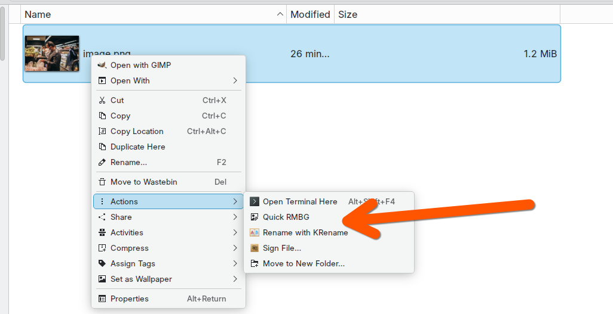
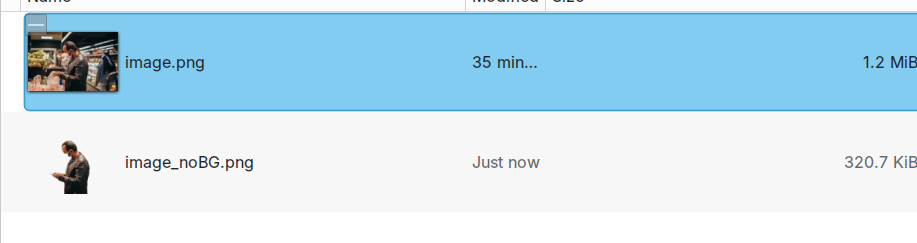

# Quick-RMBG

KDE Dolphin integration for quick background removal using [rembg](https://github.com/danielgatis/rembg).

Right-click any image in Dolphin and select "Quick RMBG" to remove its background instantly.





## Features

- **Dolphin Context Menu**: Right-click integration for seamless workflow
- **Two-Pass Mode**: Run background removal twice for cleaner results on difficult images
- **Infinite Hop Mode**: Interactive mode that keeps running passes until you're satisfied
- **GPU Acceleration**: Supports AMD (ROCm), NVIDIA (CUDA), and CPU fallback
- **Preserves Originals**: Saves output as `filename_noBG.png` alongside the original
- **Desktop Notifications**: Shows success/error status via KDE notifications

## Requirements

- **OS**: Ubuntu Linux (tested on 24.04/25.04)
- **Desktop**: KDE Plasma with Dolphin file manager
- **Python**: 3.10+
- **Package Manager**: `uv` or `pipx`
- **rembg**: Must be installed separately (see below)

## Installation

### Step 1: Install rembg

Choose the installation method based on your hardware:

#### AMD GPU (ROCm)

```bash
# Install PyTorch with ROCm support first
pip install torch torchvision --index-url https://download.pytorch.org/whl/rocm6.0

# Then install rembg
pip install "rembg[cli]"
```

#### NVIDIA GPU (CUDA)

```bash
# Install PyTorch with CUDA support
pip install torch torchvision --index-url https://download.pytorch.org/whl/cu121

# Then install rembg
pip install "rembg[cli]"
```

#### CPU Only

```bash
# Install rembg with CPU-only PyTorch
pip install "rembg[cli]"
```

**Verify installation:**

```bash
rembg --help
```

### Step 2: Install Quick-RMBG

```bash
git clone https://github.com/danielrosehill/Quick-RMBG.git
cd Quick-RMBG
./scripts/install.sh
```

This will:
1. Install the `quick-rmbg` CLI wrapper (via uv or pipx)
2. Add the Dolphin context menu entry
3. Rebuild the KDE service cache

## Usage

### From Dolphin

1. Navigate to any folder with images
2. Right-click on an image (PNG, JPG, JPEG, WEBP, BMP, TIFF)
3. Select one of:
   - **"Quick RMBG"** - Single-pass removal
   - **"Quick RMBG (Two-Pass)"** - Two passes for better results
   - **"Quick RMBG (Infinite Hop)"** - Keep running until you're satisfied
4. A notification will appear when complete
5. Find the result saved as `originalname_noBG.png`

### Two-Pass Mode

Some images leave residual background artifacts after a single pass. Two-pass mode runs rembg twice—first on the original, then on the result—for cleaner output.

**Output files:**
- First pass: `originalname_noBG-first-pass.png`
- Final result: `originalname_noBG-second-pass.png`

### Infinite Hop Mode

For images that need an unpredictable number of passes, Infinite Hop Mode lets you decide when the result is good enough. After each pass, a dialog asks if you're happy with the result:

- Click **"Yes, I'm done!"** to stop and keep the current result
- Click **"No, run another pass"** to process again

**Output files:**
- Each pass: `originalname_noBG-pass-1.png`, `originalname_noBG-pass-2.png`, etc.
- All intermediate passes are preserved so you can compare

> **Note:** This mode uses kdialog (KDE) or zenity (GNOME) for the interactive dialogs.

### From Command Line

```bash
# Basic usage
quick-rmbg photo.jpg

# Two-pass mode for cleaner results
quick-rmbg --two-pass photo.jpg

# Infinite hop mode - keep running until satisfied
quick-rmbg --infinite-hop photo.jpg

# Specify output path
quick-rmbg photo.jpg -o transparent.png

# Quiet mode (no output)
quick-rmbg photo.jpg --quiet

# No notification (print to stdout instead)
quick-rmbg photo.jpg --no-notify
```

## Configuration

Configuration is stored in `~/.config/quick-rmbg/config.json`:

```json
{
  "output_suffix": "_noBG",
  "model": "u2net",
  "rocm_gfx_version": "11.0.1"
}
```

### Configuration Options

| Option | Default | Description |
|--------|---------|-------------|
| `output_suffix` | `_noBG` | Suffix added to output filename |
| `model` | `u2net` | rembg model to use (u2net, u2netp, u2net_human_seg, silueta, isnet-general-use, isnet-anime) |
| `rocm_gfx_version` | `11.0.1` | GFX version for AMD ROCm (set to `null` to disable) |

### GPU-Specific Notes

**AMD ROCm users**: The default `rocm_gfx_version` of `11.0.1` is for Navi 32 GPUs (RX 7700/7800 XT). Adjust this value for your GPU or set to `null` if not using ROCm.

**NVIDIA users**: Set `rocm_gfx_version` to `null` in the config file. CUDA will be used automatically if available.

**CPU users**: Set `rocm_gfx_version` to `null`. Processing will be slower but works without GPU.

## Uninstallation

```bash
./scripts/uninstall.sh
```

This removes:
- The quick-rmbg CLI tool
- The Dolphin context menu entry
- Configuration files

Note: This does not remove rembg itself, which you installed separately.

## Troubleshooting

### "rembg not found"

Ensure rembg is installed and in your PATH:

```bash
pip install "rembg[cli]"
which rembg
```

### Context menu not appearing

Rebuild the KDE service cache and restart Dolphin:

```bash
kbuildsycoca6
# Then close and reopen Dolphin
```

### Slow processing

- **AMD GPU**: Ensure ROCm is installed and `rocm_gfx_version` matches your GPU
- **NVIDIA GPU**: Ensure CUDA-enabled PyTorch is installed
- First run is slower due to model download

### AMD GPU not being used

Check your ROCm installation and GFX version:

```bash
rocminfo | grep gfx
# Update config.json with the correct version
```

## License

MIT
